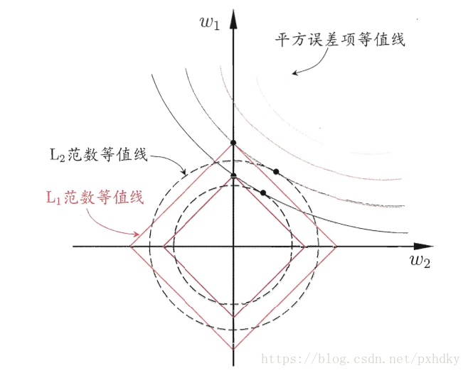

Regularization

# 1. 基础介绍

### 1.1 权重衰减 - Weight Decay

​	    即我们常说的$L_1$/$L_2$正则化。其原理为在模型的损失函数上添加惩罚项，该惩罚项与模型的权重呈一个负相关的关系。简单来说，即损失函数添加了惩罚项之后，模型的权重越大，则训练出来的损失函数越大，所以会倾向于训出权重较小的模型。可以理解为，模型倾向于使用所有输入特征，而不是严重依赖输入特征中某些小部分特征，因此提高了模型的泛化能力，降低了过拟合的风险。

假设损失函数为$\ell(\theta)$, $n$为权重的数量

- $L_1$ - $Lasso$
  - $\ell(\theta) + \frac{\lambda}{2n}||w||_1$
  - $||w||_1 = (|w_1| + |w_2| + ... + |w_n|)$
  - $\lambda$为超参数，该值越大，惩罚项在损失函数的占比越大

- $L_2$ - $Ridge$
  - $\ell(\theta) + \frac{\lambda}{2n}||w||_2^2$
  - $||w||_2^2 = (w_1^2 + w_2^2 + ... + w_n^2)$
  - $\lambda$为超参数，该值越大，惩罚项在损失函数的占比越大

- 异同
  - 两者放到损失函数内，都有助于降低过拟合的风险。
  - $L_1$更容易使得各权重变为0，所以$L_1$其实是被用于特征选择的，即无用的权重其值会被置为0，即无效。
  - $L_2$更容易使得各权重倾向于0但是不等于0，所以经常被用于处理过拟合问题。

如下图所示，若一个模型只有$w_1, w_2$两个权重。$L_1$与等值线的交点在$[0, w_1]$上，$w_2$的权重被设置为0了，即上述的特征选择。 而$L_2$与等值线的交点在$[w_2, w_1]$上，即处理过拟合问题。

### 1.2 丢弃法 - DropOut

​		原理很简单，在训练神经网络时，每层中的神经元均有$p$的概率被drop掉。

- 被drop的神经元，其输出值为0
- 未被drop的神经元，其输出为 (原输出值 / (1 - $p$)), 其目的为让这一整层的输出期望值不变
- 在本次反向传播的时候，只更新未被drop的神经元的[w, b]
- 在进行预测的时候，不应用DropOut

