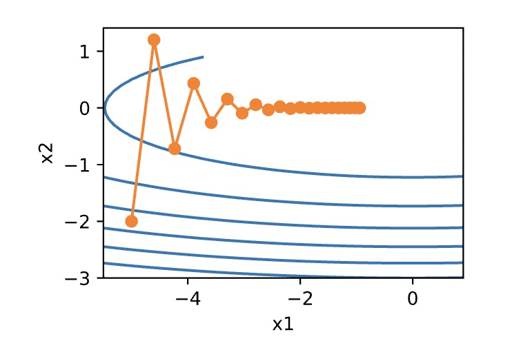

求解方式与优化器

# 1. 求解方式类别

### 1.1 最小二乘法(OLS)

**狭义的最小二乘: **指在线性回归中，采用最小二乘准则(即 $(X \beta - y)^2$最小)， 进行线性拟合参数求解的、矩阵形式的公式方法。总和来说，是在线性假设下的一种有闭式解的参数求解方法，最终结果为全局最优。

在线性回归中的应用： 
$$
\frac{\partial L}{\partial \beta_0} = -2 \sum_{i=1}^k(\gamma_i - \beta_0 - \beta_1x_{i1} - ... - \beta_p x_{ip}) = 0 \\ 
\frac{\partial L}{\partial \beta_j} = -2 \sum_{i=1}^k(\gamma_i - \beta_0 - \beta_1x_{i1} - ... - \beta_p x_{ip})x_{ij} = 0, \ \ \forall j \in \{1, p\}
$$
上式写成矩阵形式即 $X^TX\beta = X^TY$, 化简得$\hat{\beta} = (X^TX)^{-1}X^TY$

**广义的最小二乘: **即最小二乘准则(即 $(X \beta - y)^2$最小)。本质上是一种objective function

### 1.2 极大似然估计(MLE)

1. 即利用已知的样本，反推使得这样的样本出现的概率最大的参数值。
2. 假设样本之间独立同分布
3. 若总体为离散型，则其似然函数: $ L(\theta) = p(X | \theta) = \prod_{i=1}^{N}p(x_i | \theta)$, 其中$P\{X = x\} = p(x;\theta)$
4. 若总体为连续型，则其似然函数:  $ L(\theta) = p(X | \theta) = \prod_{i=1}^{N}f(x_i | \theta)$, 其中$f$为总体的概率密度函数
5. 求解似然函数，找出使得$ln(L)$最大的情况下的$\theta$值
6. $\hat{\theta} = \mathop{\arg\max}_{\theta}\ln (L(\theta)) = \mathop{\arg\max}_{\theta} \sum_{i=1}^{N} \ln p(x_i | \theta) \rightarrow \frac{\partial \ln L(\theta)}{\partial \theta} = 0$， 可以对该函数求导计算，当然也可以直接使用梯度下降来求解

该方法的最常见的应用场景为求逻辑回归的系数。

### 1.3 牛顿法(Newton’s Method)

其原理基于泰勒展开: 
$$
f(x) = \sum_{n=0}^\inf \frac{f^{(n)}(x_0)}{n!}(x-x_0)^n
$$
假设 $x^{t} = x^{t-1} + \Delta x$，将$f(x^t)$在$x^{t-1}$处进行泰勒展开，得: $f(x^t) = f(x^{t-1}+\Delta x) \approx f(x^{t-1}) + f^{\prime}(x^{t-1})\Delta x + f^{\prime \prime}(x^{t-1})\frac{\Delta x^2}{2}$

狭义的牛顿法是用来求函数值为0时，自变量值的一种方法:

1. 目标为求$f(x)=0$时$x$的值
2. 随机选择一个$x_t$
3. 求出$f(x_t)$与$f ^{\prime}(x_t)$
4. 画出一条经过$(x_t, f(x_t))$，斜率为$f^{\prime}(x_t)$的线，求出其与x轴的交点$(x_{t+1}, 0)$
5. 将$x_{t+1}$当成$x_t$，重复步骤2-4
6. 以阈值或者重复步骤为终止点
7. 逻辑原理: $x_{n+1} = x_n - \frac{f(x_n)}{f^{\prime}(x_n)}$，然后对此无限迭代
8. 其他: 放到求函数最小值时，即求$f^{\prime}(x)=0$时$x$的值，即应用二次泰勒展开

在求目标函数最小值时的应用: 

1. 假设目标函数为$L(\theta)$， 目标为求该目标函数的最小值
2. 将一阶导数记为$L^{\prime}(\theta^{t-1}) = g$，二阶导数记为$L^{\prime \prime}(\theta^{t-1}) = h$
3. 将$L(\theta^t)$在$\theta^{t-1}$处进行二阶泰勒展开: $L(\theta^t) \approx L(\theta^{t-1}) + g(\theta^{t-1})\Delta \theta + h(\theta^{t-1}) \frac{\Delta \theta^2}{2}$
4. 为了使$L(\theta^t)$最小，即让$g\Delta \theta + h \frac{\Delta \theta^2}{2}$最小，即令$\frac{\partial(g \Delta \theta + h \frac{\Delta \theta^2}{2})}{\partial \Delta \theta} = 0$
5. 求得$\Delta \theta = -\frac{g}{h}$， 所以$\theta^t = \theta^{t-1} + \Delta \theta  = \theta^{t-1} - \frac{g}{h}$
6. 将参数$\theta$推广到向量形式，得到最终迭代公式为: $\theta^t = \theta^{t-1} - H^{-1}g$，其中$H$为Hessian矩阵
7. 其他1: 其收敛速度很快，在迭代过程中$H$的逆矩阵($H^{-1}$)在不断减小，起到了逐步减小步长的效果
8. 其他2: 现在一般使用梯度下降而不是牛顿法的原因是:
   1. 牛顿法使用的是目标函数的一阶导数+二阶导数进行求解，在高维情况下这个矩阵非常大，计算困难
   2. 在mini-batch的情况下，牛顿法对二阶导数的估计噪音太大
   3. 函数非凸时，牛顿法容易受到鞍点/最大值的吸引

### 1.4 梯度下降(Gradient Descent)

原理: 

1. 假设目标函数为$L(\theta)$，目标为求该目标函数的最小值
2. 迭代过程: $\theta^t = \theta^{t-1} - \alpha \frac{\partial L(\theta)}{\partial \theta^{t-1}}$

3. 相当于该参数在目标函数于$t-1$step的偏导值，乘上学习率。然后与原参数值相减。
4. 其实就是求在某一点上的偏导数，延偏导方向行进。就是往导数方向走。

# 2. 优化器类别

**梯度下降要使用优化器的原因**: 当目标函数在不同方向的斜率不一致，会导致在给定固定学习率的情况下，不同方向上参数的波动幅度不一致。以$f(x) = 0.1x_1^2 + 2x_2^2$为例，那么以$x_2$为y轴，$x_1$为x轴，使用梯度下降求$f(x)$的最小值，会发现，在竖直方向上波动特别大，水平方向上波动很小。

如下图所示: 

### 2.1 Momentun

- $v_t \leftarrow \gamma v_{t-1} + \alpha g_t$
- $x_t \leftarrow x_{t-1} - v_t$
- 其中$\gamma$为范围在$[0,1]$参数，$\alpha$为学习率，$g_t$为梯度，$v_t$初始为元素为0的向量
- 原理: 更新自变量的时候，除了梯度和消息屡，还会考虑各个梯度在各个方向是否一致，依赖指数加权移动平均使得自变量的更新方向一致，从而降低发散的可能

### 2.2 AdaGrad

- $s_t \leftarrow s_{t-1} + g_t \odot g_t$
- $x_t \leftarrow x_{t-1} - \frac{\alpha}{s_t + \epsilon} \odot g_t$
- 其中$\alpha$为学习率，$g_t$为梯度，$\epsilon$是一个很小的常数，一般用$1e-6$
- 原理: 相当于根据梯度调整自变量在每个维度上的学习率大小，即自变量的某个维度偏导大，则用小学习率，反之则用大学习率
- 缺陷: 其学习率相当于一致在下降，所以若在迭代前期没有找到满意的解，迭代后期会过小的学习率会使得很难找到优秀的解

### 2.3 RMSProp

- $s_t \leftarrow \gamma s_{t-1} + (1 - \gamma)g_t \odot g_t$
- $x_t \leftarrow x_{t-1} - \frac{\alpha}{s_t + \epsilon} \odot g_t$
- 其中$\alpha$为学习率，$g_t$为梯度，$\epsilon$是一个很小的常数，一般用$1e-6$
- 原理: 相当于结合了Momentum的思想，对AdaGrad进行了迭代

### 2.4 Adam

- $v_t \leftarrow \beta_1 v_{t-1} + (1 - \beta_1) g_t$
- $s_t \leftarrow \beta_2 s_{t-1} + (1 - \beta_2) g_t \odot g_t$
- $\hat{v_t} \leftarrow \frac{v_t}{1 - \beta_1^t}$
- $\hat{s_t} \leftarrow \frac{s_t}{1 - \beta_2^t}$
- $x_t \leftarrow x_{t-1} - \frac{\alpha \hat{v_t}}{\hat{s_t} + \epsilon}$
- 原理: Momentum + RMSProp的最终结合版

