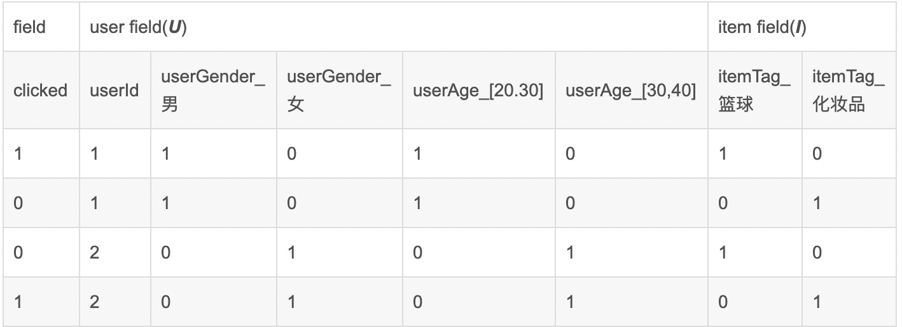

FM / FFM / DeepFM

# FM

### 1 基础介绍

**因子分解机(Factorization Machine)**。FM主要是为了解决数据稀疏的情况。**数据稀疏**是指数据的维度很大，但是其中为0的维度很多。常见的应用场景为推荐系统，因为商品id很多，经过one-hot之后会产生含大量0的特征，导致样本稀疏。

FM可以解决以下三类问题:

- 回归: $x$的元素和$y$均为实数
- 二分类: $x$的元素为实数, $y$为±1
- 排序: $x = (x^{a}, x^{b})$为有序对，$y$为±1

### 2 原理介绍

#### 2.1 原理

​	通过观察，发现某些特征经过关联之后与$y$的相关性就会变高。例如: '男性' + '篮球'、'女性' + '化妆品'这样的关联组合，对用户的点击有着正向的影响。这种关联特征与$y$的正相关性在实际问题中式普遍存在的。所以接下来的问题是如何进行特征组合。

#### 2.2 组合特征

多项式模型时包含特征组合的最直观的模型。在多项式模型中，特征$x_i$和$x_j$的组合采用$x_ix_j$表示。即$x_i$和$x_j$均非0时，组合特征$x_ix_j$才有意义。只讨论二阶多项式，模型的表达式如下:
$$
y(X) = w_o + \sum_{i=1}^{n}w_ix_i + \sum_{i=1}^{n-1} \sum_{j=i+1}^{n} w_{ij}x_ix_j
$$

- $n$表示样本(one-hot之后)的特征数量；
- $x_i$表示第$i$个特征；
- $w_{ij}$表示$x_i$与$x_j$的组合参数；(注: $w_{ij} = w_{ji}$，因此组合特征部分相关参数共有$(n-1) + (n-2) + ... + 1 = \frac{n(n-1)}{2}$)个
- $w_o$为全局偏置量

从表达式来看, 其实FM = LR线性部分 + 多项式部分。所以说FM至少比LR好，因为只用把组合参数全部置为0即为LR模型了。并且， 可以看出，组合参数共$\frac{n(n-1)}{2}$个，在特征数量比较大的情况下，多项式部分的参数训练时很困难的，他因为每个组合参数$w_{ij}$的训练需要大量$x_i$和$x_j$均非0的样本，训练样本不足，很容易导致$w_{ij}$不准确，最终使得模型性能变差。

#### 2.3 解决组合参数训练问题

矩阵分解(Factorization)为解决这个问题提供了思路。在model-based的协同过滤中，一个rating矩阵可以分解为user矩阵和item矩阵，每个user和item都可以采用一个隐向量表示。比如在下图中的例子中，我们把每个user表示成一个二维向量，同时把每个item表示成一个二维向量，两个向量的点积就是矩阵中user对item的打分。

将每个user与item都表示成一个二维向量，两个向量的点积即矩阵中user对item的打分。

有定理如下，实对称矩阵$\vec{A}$都可以被分解成$\vec{A} = \vec{Q} \vec{\wedge} \vec{Q}^T$。其中, $\vec{Q}$为正交矩阵，$\vec{\wedge}$为实对角矩阵。

而FM中的组合参数$w_{ij}$就可以组成一个实对称矩阵$\vec{W}$(因为$w_{ij} = w_{ji}$)，那么这个矩阵就可以分解为$\vec{W} = \vec{V}^T \vec{V}$。$\vec{V}$的第$j$列($v_j$)就是第$j$维特征($x_j$)的隐向量。换句话说，组合参数$w_{ij}$的值等于$x_i$的隐向量与$x_j$的隐向量的内积。即每个参数$w_{ij} = <v_i,v_j>$，**这就是FM模型的核心思想,即将求组合参数的值改为了求隐向量的值**。

为了求出$w_{ij}$，我们需要求出特征分量$x_i$的辅助向量$v_i = (v_{i1},...,v_{ik})$，$x_j$的辅助向量$v_j = (v_{j1},...,v_{j})$，$k$表示隐向量的长度($k$ << $n$)，转换过程如下图所示:

因此，FM的表达式变成了(不讨论高阶的FM形式):
$$
\hat{y}(X) = w_o + \sum_{i=1}^{n}w_ix_i + \sum_{i=1}^{n-1} \sum_{j=i+1}^{n} <v_i,v_j>x_i x_j (式1)
$$

$$
<v_i, v_j> = \sum_{f=1}^{k} v_{i,f}·v_{j,f}(式2)
$$

$$
\sum_{i=1}^{n-1} \sum_{j=i+1}^{n} <v_i,v_j>x_i x_j = \frac{1}{2}\sum_{f=1}^{k}[(\sum_{i=1}^{n}v_{i,f} x_i)^2 - \sum_{i=1}^{n}v^2_{i,f} x_i^2]（式3）
$$

- $v_i$是第$i$维特征的隐向量
- $<·,·>$代表向量点积
- 隐向量的长度为$k$ ($k$  << $n$)，包含$k$各描述特征的因子，这里的k是超参数(可以选择4试一试)
  - 其中$v_i = (v_{i1}, ...,v_{if},..., v_{ik})$
  - 式2中的$v_{i,f}$就相当于上面的$v_{if}$
- 由式3可知，$v_{i,f}$的训练只需要样本$x_i$的特征非0即可，而不是像之前的形态需要$x_i$和$x_j$均非0

具体来说，$x_hx_i$和$x_ix_j$的系数分别为$<v_h,v_i>$和$<v_i,v_j>$，他们之间有共同项$v_i$，也就是说，所有包含$x_i$的非零组合特征的样本，都可以用来学习隐向量$v_i$，这就很大程度上避免了数据稀疏造成的影响。

而且，隐向量可以表示之前没有出现过的交叉特征。加入在数据集中经常出现 (男+篮球)、(女+化妆品)的组合，但是没出现过(男+化妆品)、(女+篮球)，这时候如果用$w_{ij}$表示(男+化妆品)的系数，就会得到0，但是有了男特征和化妆品特征的隐向量之后，就可以通过求解$<v_{男},v_{化妆品}>$来求解。

最后，在训练FM模型的时候，在确定了损失函数之后，就可以直接对使用了隐向量的表达式做梯度下降，就可以求出最后各权重的值。其训练复杂度为$O(kn)$

### 3. 总结

- 原始形态: $y(X) = w_o + \sum_{i=1}^{n}w_ix_i + \sum_{i=1}^{n-1} \sum_{j=i+1}^{n} w_{ij}x_ix_j$

  - 相当于LR + 多项式。其中多项式相当于将one-hot之后的特征进行组合，然后这个组合的特征有一个权重$w_{ij}$
  - 组合特征的目的是，$y$很可能与特定的组合特征呈正/反向相关。如(男性+篮球)的组合会让点击率变高
  - 但是这个形态的表达式是有问题的，因为$w_{ij}$的训练需要大量$x_i$和$x_j$都非0的样本，但是one-hot之后，各个特征都会有非常多的0，所以$w_{ij}$的训练非常艰难。

- 改进形态:$\hat{y}(X) = w_o + \sum_{i=1}^{n}w_ix_i + \sum_{i=1}^{n-1} \sum_{j=i+1}^{n} <v_i,v_j>x_i x_j $

  - 相当于将原始形态的$w_{ij}$改成了$<v_i,v_j>$，原理大致是通过一系列数学推导，我们发现$w_{ij}$ = $x_i$的隐向量和$x_j$的隐向量内积($v_i$为$x_i$的隐向量)
  - 所以问题就变成了求$x_i$的隐向量，所有包含$x_i$的非零组合特征均可用于求该隐向量。即$x_i$与任意特征组合，只要两者均不为0，就可以给求$x_i$的隐向量提供信息，这就是FM最重要的部分。使得FM可以解决数据稀疏的问题。(例子: 在原始形态中, $w_{hi}$和$w_{ij}$相互独立。但是在改进形态中，$<v_h,v_i>$与$<v_i,v_j>$因为有共同项$v_i$，他们都会对计算$v_i$提供支持)

# FFM

### 1. 基础介绍

在FM中，(男性+年龄)或(男性+篮球)所起的潜在作用是一致的，因为FM并没有区分出年龄、篮球之间有什么区别，但是实际上并不一定。为了让算法能够捕捉特征之间的差异，引入了**FFM(Field-aware Factorization Machines)**这个概念。

即相较于FM，FFM认为每一个feature都会属于一个field。

### 2. 原理介绍

#### 2.1 原理

在FFM中，每一个feature(尚未one-hot)都归属于一个特定的field，field和feature是一对多的关系，如下图所示:

即$v_i$不仅与$x_i$有关，还跟与$x_i$相乘的$x_j$所属的Field有关系。即$v_i$成为了一个二维向量$v_{F·K}$。其中$K$是隐向量的长度, $F$是Field的总个数。设样本一共有$n$个特征，$f$个Field，那么FMM的二次项有$nf$个隐向量。而在FM中，每一维的特征的隐向量只有一个。所以，FM可以看做FFM的特例，即把所有特征都归属于一个field时的FFM模型。

FFM的表达式如下:
$$
y(X) = w_o + \sum_{i=1}^{n}w_i x_i + \sum_{i=1}^{n-1} \sum_{j=i+1}^{n} <V_{(i, f_j)}, V_{(j,f_i)}> x_i x_j
$$
其中，$f_j$是第$j$特征的所属字段，如果隐向量的长度为$k$，那么FFM的组合参数由$nfk$个，远多于FM模型的$nk$个。此外，由于隐向量与field相关，所以FFM的组合参数并不能花间，时间复杂度是$O(kn^2)$ 

#### 2.2 组合特征

针对上图，FM的交叉项为:
$$
FM(V,x) = <V_{man}, V_{[20,30]}> + <V_{man}, V_{basket}> + <V_{basket}, V_{[20,30]}>
$$
而FFM的交叉项为:
$$
FFM(V,x) = <V_{(man)}, V_{([20,30])}> + <V_{(man,I)}, V_{(basket,U)}> + <V_{(basket,U)}, V_{([20,30],I)}>
$$

- $<V_{(man)}, V_{([20,30])}>$均为User Field，所以不做区分
- $<V_{(man,I)}, V_{(basket,U)}> | <V_{(basket,U)}, V_{([20,30],I)}>$这两项所属field不同，所以要考虑特征的latent vector

### 3. 总结

FFM即在FM的基础上，增加了Field这个概念，会把每一个特征都分到对应的Field。并且相对于FM而言复杂度也更高。

一般来说，在CRT/CVR预估的场景，Field主要分三类

- 用户相关的特征
  - 年龄、性别、职业、兴趣、品类偏好、浏览/购买品类、用户近期点击/消费额/购买量 等信息
- 商品相关的特征
  - 商品所属品类、销量、价格、评分、历史CTR/CVR信息
- 用户-商品匹配特征
  - 浏览/购买品类是否匹配、浏览/购买商家是否匹配、兴趣偏好是否匹配等

训练FFM也有一些小细节需要注意:

- 样本归一化
  - FFM默认是进行样本数据归一化的，如果不诡异，很容易造成梯度计算错误
- 特征归一化
  - 一般FFM模型的数据源都是多类型的，包含数值型和分类型。但是categorical类编码后的特征取值只有0或1，较大的数值型特征会造成样本归一化后categorical类生成特征的值非常小，没有区分性。所以需要将数值型特征的值进行归一化。
- 省略零值特征
  - 在FFM中，零值特征(即全为0的)对模型完全没有贡献。因此可以省去零值特征，提高FFM模型训练和预测的速度。

# DeepFM

### 1. 基础介绍

​	前文介绍的FM，是通过对于每一维特征的隐变量内积来提取特征组合。虽然FM理论上来说可以对高阶特征组合进行建模，但实际上因为计算复杂度的原因，一般在FM中都只用到了二阶特征组合。为了用上高阶的特征组合，很自然的想法就是运用DNN去解决。

### 2. 原理介绍

#### 2.1 原理

​		DeepFM中就包含了两部分，DNN部分与FM部分。其中DNN负责高阶特征的提取，FM负责低阶特征的提取。这两部分共享同样的input与embedding vector，训练更高效。并且除了one-hot，不需要进行任何特征工程。

DeepFM的总体网络结构图:

DeepFM的预测结果可以写为: $\hat{y} = sigmoid(y_{FM} + y_{DNN})$

- 上图中各箭头的含义
  - **Weight-1 Connection**表示，不可被训练且值恒等于1的权重
  - **Normal Connection**表示，可被训练的权重
  - **Embedding**表示，可被训练的隐向量.（在这里其实就是一个全连接，与Normal Connection其实没啥区别）
  - **Addtion**表示，所有输入相加
  - **Inner Product**表示，该units的输出为两个向量的乘积
  - **Yellow/Blue Circle**表示，在Sparse Feature中，蓝点表示为0，黄点表示1，他们都是one-hot之后的输入
- Field
  - 即一个categorical进行one-hot之后的总和
  - 即一个continuous的值本身

#### 2.2 FM部分

FM部分:

这一部分其实就是FM。
$$
y = w_0 + \sum_{i=1}^nw_ix_i + \sum_{i=1}^{n-1}\sum_{j=i+1}^{n}<v_i, v_j>x_ix_j
$$

- 这里面的一个Field即表示一个特征进行one-hot之后的子特征之和
- 这里的$<v_i, v_j>$，可以理解为上述结构中，输入层到Dense Embedding层中间的权矩阵。
- Dense Embeddings层的神经元个数是由Embedding Vector与Field Size共同确定的，即神经元的个数为embedding_size * field_size

#### 2.3 Deep部分

Deep部分:

可以看出，为了避免categorical one-hot之后，跟下一层进行全连接产生巨量参数，所以借用了FFM的思想。将变量按Field分，即一个Feature进行one-hot之后产生的子特征们与Dense层进行全连接，然后再将这些Dense进行concat，形成Dense Embedding层。所以，在DeepFM中,输入有几个Field，下一层就有几个独立的Dense层，将这几个Dense层concat之后，形成了真实的输入之后的下一层(Dense Embeddings)。

该部分的正向反馈如下图所示

- 尽管不同Field的输入长度不同,但是经过embedding之后, 在Embedding层的子向量长度均为k
- FM里的隐变量$v_{ik}$现在作为了embedding层的网络权重，即用于将输入层的field_vector压缩成embedding_vector
- 这里面的$v_{ik}$是和整个网络一起训练的，因为在DeepFM里，FM和Deep部分是合在一起的，所以不需要预训练隐向量。
- embedding层其实就可以理解为，全连接的一个特殊案例，即输入为one-hot的全连接

### 3. 总结

- 分为FM部分与Deep部分
- Input Layer 连接 Dense Embeddings的权重为隐向量
- 在coding的时候，其实用的是类似one-hot的embedding_lookup
  - 相当于每一个Field都是一个神经元，这个Field对应连接的Embedding层的神经元不变
  - 但是每一次随着这个Field的类别在变动，连接Embedding层与输入层的隐向量随着这个Field类别在变

