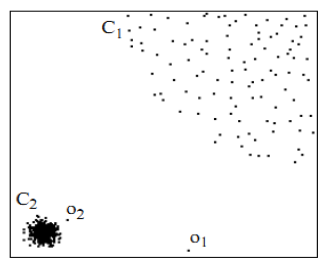
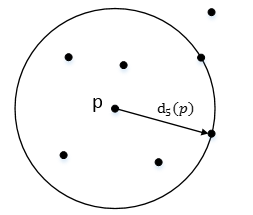
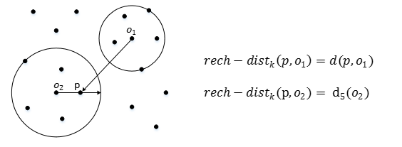

Local Outlier Factor

## 1. Intro

​	LOF 是一种基于距离的异常检测算法

​	下图我们可以发现，C1和C2是数据的两个簇，而o1和o2相对孤立，可以认为它是异常点

​	LOF即可通过距离来计算出异常点

## 2. Parmas Intro

1. $d(p, o)$: 点p与点o之间的距离

2. k-distance: 第k距离

   ​	对于点p的第k距离$d_k(p) = d(p, o)$有如下定义:

   ​	点p的第k距离, 即距离p第k远的点的距离(不包括p), 如下图

​                                                                    	

3. k-distance neighborhood of p: 第k距离领域

   ​	点p的第k距离领域$N_k(p)$即p的第k距离以内的所有点, 包括第k距离

   ​	因此p的第k领域点的个数$|N_k(p)| \geq k$

4. reach-distance: 可达距离

   ​	点到点p的可达距离为$rech - dist_k(p, o)$

   ​	$reach - distance_k(p,o) = max(k - distance(o), d(p,o))$

   ​        即比较$d_k(p)$与$d(p, o)$, 谁比较大谁就是可达距离

   ​	如下图，其实就是画个第k距离的圈，然后和两点之间的距离进行比较，谁大取谁

   ​	

5. local reachability density: 局部可达密度

   ​	$lrd_k(p) = 1 / (\frac{\sum_{o \in N_k(p)}rech - dist_k(p, o)}{|N_k(p)|})$ =$ \frac{|N_k(p)|}{\sum_{o \in N_k(p)} rech - dist_k(p, o))}$

   ​	即点p的第k领域内点到p的平均可达距离的倒数

   ​	注意，是p的领域点$N_k(p)$到p的可达距离，而不是p到$N_k(p)$的可达距离。并且，如果有重复点，那么分母的可达距离之和有可能为-，则为导致lrd变为无限大

   ​	这个值我们可以将其看为密度，密度越高，越有可能属于同一簇，反之亦反。如果点p和周围的领域点是同一簇，那么可达距离越可能为较小的$d_k(o)$，导致可达距离之和较小，密度值较高，反之亦反。

6. Local outlier factor: 局部利群因子

   ​	$LOF_k(p) = \frac{\sum_{o \in N_k(p)} \frac{lrd_k(o)}{lrd_k(p)}}{|N_k(p)|}$ = $\frac{\sum_{o \in N_k(p)} lrd_k(o)}{|N_k(p)|} / lrd_k(p)$

   ​	表示点p的领域点$N_k(p)$的局部可达密度与点p的局部可达密度之比的平均数。

   ​	这个比值越接近于1，越说明p和其领域点同属一簇； 反之亦反。

## 3. Summary

​	LOF主要就是通过比较每个点p和其领域点的密度来判断该点是否为异常点，如果点p的密度越低，则越有可能被认定为异常点。而密度是通过点之间的距离来计算的，点之间的距离越远，则密度越低;反之亦反。而且，因为LOF对密度是通过点的第k领域进行计算的，而不是全局计算，因此叫做局部异常因子。