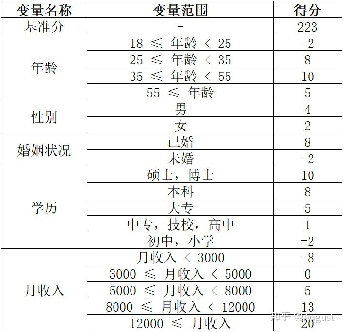

评分卡流程

### 0. 基础介绍

下图就是一个很典型的由LR模型训练出的评分卡模型。

下面介绍评分卡开发的流程，假定lebel是binary，并且所有数据都已经清洗好了。

### 1. 变量分箱

分箱的目的是:

- 对连续变量进行分段离散化；
- 对离散变量进行类别合并，减少离散变量的类别数量。

分箱的好处:

- 有效处理特征中的缺失值与异常值；
- 分箱后，数据和模型会更稳定；
- 简化LR模型，降低模型过拟合风险，提升模型泛化能力；
- 将所有特征转变为离散变量；
- 特征分享后才可以使用标准的评分卡格式，即对不同的分段进行评分。

这里介绍最常用的chi-merge 分箱。

1. 输入: 该变量分箱的最大区间数n
2. 初始化:
   1. 为了减少计算量，连续变量若unique_value大于某一阈值(建议100)，则先使用等频分箱进行粗分箱(当然算力足够也可以不这么做)；
   2. 连续变量按照升序排列(每一个unique_value当做一个类别)；
   3. 离散变量转化成每个类别坏客户的比例，然后再按照升序进行排序；
   4. 若有缺失值，则缺失值单独作为一个箱，不放入排序的行列，后续介绍如何处理该箱；
   5. 若有异常值，则异常值单独作为一个箱，不放入排序的行列，后续介绍如何处理该箱。(也可以不对其做处理，比如500岁的人也会被分到>55岁这一箱内)
3. 合并区间1
   1. 计算每一对相邻区间的卡方值
      1. $\chi^2 = \sum_{i=1}^2 \sum_{j=1}^2 \frac{(A_{ij} - E_{ij})^2}{E_{ij}}$
      2. $A_{ij}$为第$i$个区间第$j$类label的数量。(因为对比的是相邻区间，所以$i=2$； 因为label为binary，所以$j=2$)
      3. $E_{ij}$为第$i$个区间第$j$类label的期望值。计算方式为$E_{ij} = \frac{N_i}{N} * C_j$, 其中$N$为两个区间的样本总量，$N_i$为第$i$个区间的样本量，$C_j$为第$j$类label在两个区间的样本数。
   2. 将卡方值最小的一对区间进行合并
4. 重复2、3两个步骤，直到分箱数量不大于$n$
5. 合并区间2
   1. 如果合并后的区间内全为正例或者负例，则将该区间与和他$\chi^2$值最小的区间进行合并，直至该区间正负例均存在；
   2. 如果合并后的区间内，某区间占总样本数小于阈值(一般默认5%)，则将该区间与和他$\chi^2$值最小的区间进行合并，直至该区间的样本数占总样本数阈值以上；
   3. 如果合并后的区间，不满足单调性(区间从上到下的bad_rate单调递增或单调递减)，则将$\chi^2$值最小的区间进行合并，直至连续区间上满足单调性(该项是可选项，可以满足单调性也可以不满足)。
6. 其他
   1. 完成了上述内容之后，将缺失值箱与异常值箱加入合并区间，作为单独的一个区间；
   2. 缺失值区间与异常值区间是可能存在区间内全为正例或者负例，这回对后续的WOE值计算产生影响，在后续介绍；
   3. 每一个区间即一个箱，变量分箱完成。

### 2. WOE编码

WOE介绍:

- WOE为`weights of evidence`, 是一种有监督的编码方式；

- 将分箱后的离散变量转化为连续变量；

- 实际上的含义是，“当前箱中，坏客户占所有坏客户的比例” 与 “当前箱中，好客户占所有好客户的比例”的差异。差异越大，WOE绝对值越大；

  

WOE目的与优点:

- 可以将特征转化为线性
- 相当于把分箱后的特征从非线性可映射到近似线性可分空间
- 可以提升模型的预测效果
- 将自变量规范到同一尺度上
- WOE能反应自变量取值的共享情况
- 有利于对变量的每个分箱进行评分
- 转化为连续变量后，便于分析变量与变量之间的correlation

WOE计算方式:

- $WOE_i = \ln (\frac{\#B_i / \#B_T}{\#G_i / \#G_T})$
- $B_i$为第$i$箱中坏客户的数量; $B_T$为总体中坏客户的数量
- $G_i$为第$i$箱中好客户的数量; $G_T$为总体中好客户的数量

WOE的特殊情况:

​		在1. 变量分箱中提到了, 像缺失值箱或异常值箱等特殊箱有可能存在,该箱内全部为好样本或者全部为坏样本,那么这种情况用上述WOE的计算公式其实是算不出来的, 所以这里提出一个调整过的WOE计算方式用来处理该问题
$$
Adjusted\_WOE_i = \ln (\frac{\#B_i + 1 / \#B_T + 2}{\#G_i + 1 / \#G_T + 2})
$$
​		即在式子上下的分子分母(+1, +2);  直接对所有箱使用$Adjusted\_WOE$或者只在特殊箱使用$Adjusted\_WOE$均可. 这里推荐直接对所有箱都使用该公式,毕竟更方便. (但是其实算出来还是会有一定差距的)

### 3. 单变量筛选

- 基于IV的变量筛选
  - $IV_i = (\frac{\#B_i}{\#B_T} - \frac{\#G_i}{\#G_T})*WOE_i$
  - 变量对应的$IV$值为其所有箱的$\sum IV_i$， 一般分为`<0.02; 0.02-0.10; 0.10-0.20; >0.20`四个级别，预测能力从低到高
  - 其取值范围为$[0, +\inf)$，当分箱中只包含好客户或坏客户时$IV$为无穷大，当分箱中好坏客户比例等与整体好坏客户比例时$IV$为0
- 基于stepwise的变量筛选
  - 前向选择: 逐步将一个个变量放入模型，然后根据响应指标判断是要保留该变量还是筛去
  - 后向选择: 将所有变量纳入模型，挨个移除不符合指标的变量，直至满足一定规则之后停止
  - 逐步选择: 逐步放入最优变量，移除最差变量
  - 一般来说这里的指标指的是AIC
- 基于特征重要度的变量筛选
- 基于LASSO正则的变量筛选

### 4. 变量相关性分析

- 两两相关性分析
  - 一般来说，当相关系数大于阈值时(一般为0.7或0.4)，剔除$IV$值较低的变量，或分箱严重不均衡的变量
- 多重共线性分析
  - 通过$VIF$查看变量之间的多重共线性
  - 当某变量$VIF$大于阈值时(一般为10或7)，选$IV$值较低的那个剔除，直至其满足阈值

### 5. 构建LR模型

- 检查模型中各个变量的系数是否均为正值
  - 某箱中，坏客户占比越大，$WOE$也就越大，即该箱中客户为坏客户的比例也就越大。即$WOE$与逻辑回归的预测结果成正比
  - 理论上来说，$WOE$编码之后的变量系数一定为正值，当某些变量出现负值时，说明这些变量的线性相关性比较强，导致权重有无数种取法，既可以为正也可以为负

- 通过P-value筛选
  - 当$P>0.05$时，说明该变量与因变量线性无关，筛去该变量
- 模型评估
  - AUC/KS/CM

### 6. 转化为评分卡

1. 逻辑回归得出: $ln(\frac{p}{1-p}) = \theta^T x$

2. 定义$odds = \frac{p}{1-p}$， 即坏客户与好客户之比。
3. 评分卡分值可以通过 $Score = A + B*ln(odds)$来表示，其中A与B均为常数
4. 假定某个特定违约概率下的预期评分，即$odds$为$\theta_0$时的分数为$P_0$，该违约概率翻倍的评分为$PDO$ (points of double odds)
5. 联立方程组$\begin{cases}P_0= A + B * ln(\theta_0) \\ P_0 + PDO = A + B * ln(2\theta_0) \end{cases}$

6. 解得: $\begin{cases}B = \frac{PDO}{ln2} \\ A =P_0 - B * ln(\theta_0) \end{cases}$

7. 例子
   1. 假定$\theta_0 = 1/60,\ P_0=600, \ PDO=-20$
   2. 解得，$Score = 481.89 - 28.85 * \ln(odds)$
   3. 训练完模型得到$\theta^T$。对某一各样本$X$而言，只用将$odds = e^{\theta^TX}$代入上述公式，即可获得该样本在评分卡内的分值

