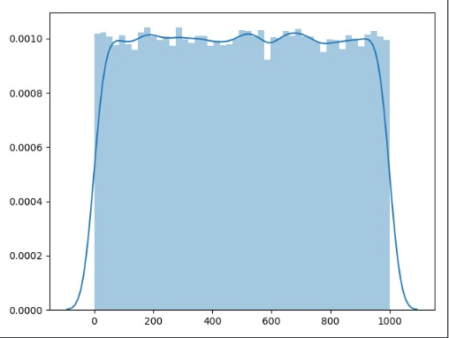
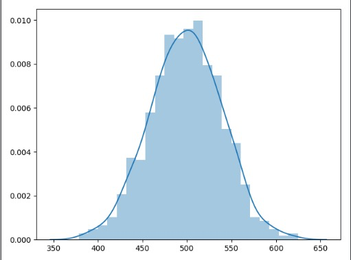

<center><font size = 10> Central Limit Therom</font></center>

# 1. 基础介绍

现有一个符合同一个分布的总体。该总体的均值为 $\mu$ , 方差为$\sigma^2$。对这个总体做m次有放回的抽样，每次抽取n个样本。对这m组样本求均值。形成一个新的变量$\bar{X}$。该变量的分布近似于均值为$\mu$，方差为$\frac{\sigma^2}{n}$。


# 2. 代码

```python
import random
import seaborn as sns
import numpy as np
import matplotlib.pyplot as plt
x = [random.uniform(0, 1000) for j in range(100000)]
samples = []
means = []
for i in range(0, 1000):
    sample = []
    for j in range(0, 50):
        sample.append(x[random.randint(0, 100000)])
    means.append(np.mean(sample))
sns.distplot(means)
plt.show()
```

从uniform(0, 1000)中抽100000个样本形成总体。

对这个总体做1000次抽样，每次抽50个样本。


总体的分布:



样本均值的分布:

