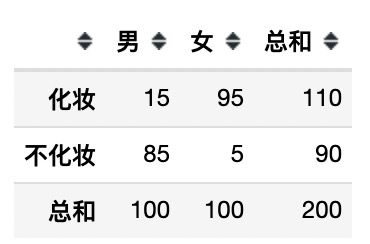

 各种检验

# 1. 假设检验

-  定义
  
  - 对总体参数提出一个假设值，利用样本信息判断这一假设是否成立
- 假设
  - 会设置两个假设，一个叫原假设$H_0$, 一个叫备择假设$H_1$
  - 一般都会把我们想要拒绝的假设放到原假设上，因为原假设为真但被拒绝的概率被显著性水平(即$I$类错误)控制了
- 显著性水平
  - 指的是原假设为真，但是统计量落在拒绝域的概率。
  - 显著性水平越小，那么犯第$I$类错误的概率越小。
  - 一般取值: $\alpha = 0.01, 0.05$
- 原理
  - 其实假设检验是基于CLT的，即抽样抽的足够多，样本足够大，那么样本的均值就会符合正态分布
  - 根据这一特性，就能针对样本与总体的特性，构造出符合某一分布的统计量(即通过正态分布进行变体，构造出其他分布)
  - 接着去检验，该统计量落在拒绝域的概率
- 检验方式
  - 双侧检验: 备择假设没有特定的方向性，即形式为$\ne$的假设检验
  - 单侧检验: 备择假设有特定的方向性，即形式为$\gt, \lt$的假设检验
- 例子
  - 在原假设为真的情况下，通过公式针对样本的均值构造出一个统计量，该统计量符合标准正态分布
  - 假设计算出在样本中，该统计量的值为-2
  - 我们已知从标准正态分布中抽样，该值小于-1.96的概率为0.05。$P(|x| > 1.96) = 0.05$
  - 所以在0.05的显著性水平下，拒绝原假设。(因为统计量落在拒绝域了，相当于统计量会取到这个值的概率太小了)
  
  

##  1.2 Z - Test

- Z分布
  - $X$符合正态分布$N(\mu, \sigma^2)$
  - $z = \frac{X - \mu}{\sigma}$服从标准正态分布
- 原理
  - 应用: 已知总体的方差且该总体符合正态分布。通过从总体中抽样出的样本，检验该总体的均值是否等于某值。
  - 统计量: $z = \frac{\bar{X} - \mu_0}{\sigma}$, 其中$\bar{X}$为样本均值，$\sigma$为总体标准差，$\mu_0$为我们要检验的总体均值是否等于该值的那个值。
  - $H_0: \mu = \mu_0$ , 即总体的均值等于某一值。(一般来说这个某一值就是样本的均值)。当假设为真时，上述$z$统计量服从标准正态分布
  - 例子: 某电器零件的电阻在改变工艺后的方差为0.06，且符合正态分布。工艺改变前其平均电阻为2.64。工艺改变后测100个零件得到其电阻平均值为2.62。使用z-test检测新工艺是否时零件的电阻变小。
- 其他
  - 当样本量较大$n > 30$并且已知总体的方差和总体为正态分布，才使用z-test。
  - 一般而言我们不知道总体的方差，所以都会去选用t-test。
  
  

## 1.3 T - Test

- T分布

  - $X$服从正态分布$N(0,1)$, $Y$服从自由度为$n$的卡方分布。且$X,Y$相互独立
  - 则$t = \frac{X}{Y/n}$, 该构造出的统计量服从自由度为$n$的$t$分布

- 原理

  - https://www.mediecogroup.com/method_topic_article_detail/350/
  - 从正态分布$N(\mu, \sigma^2)$总体中抽取$n$个样本，根据CLT，该样本的均值$\bar{X}$符合正态分布$N(\mu, \sigma^2/n)$
  - 将样本均值的分布标准化为统计量$Z = \frac{\bar{X} - \mu}{\sqrt{\sigma^2 / n}}$ 服从标准正态分布$N(0, 1)$

  - 这个时候其实$\sigma$的值我们是未知的，但是我们可以计算出样本方差$S^2$
  - 构造出统计量$t$, $t = \frac{\frac{\bar{X} - \mu}{\sqrt{\sigma^2 / n}}}{\sqrt{\frac{(n-1)S^2 / \sigma^2}{n - 1}}} = \frac{\bar{X} - \mu}{S / \sqrt{n}}$， 易证$\frac{(n-1)S^2}{\sigma^2}$为自由度$n-1$的卡方分布。所以根据上一点中的T分布的概念，我们可以确定该统计量$t$为自由度$n-1$的$T$分布
  - 所以若数据总体为正态分布且均值已知，则可以构造出t统计量，来确定拒绝原假设的$P$是多少

- 类别
  - 单样本t检验 (One-sample t-test)
    - 应用: 检验一个样本平均值与已知总体的平均值是否有显著差异。该总体需要满足正态分布，且平均值已知但标准差未知。
    - 统计量: $t = \frac{\bar{X} - \mu}{\sigma_x / \sqrt{n}}$, 其中n为样本量, $\bar{X}$为样本平均值, $\mu$为总体平均值, $\sigma_x$为样本标准差
    - $H_0$: $\mu = \bar{X}$为真时，上述$t$统计量服从自由度为$n-1$的t分布
    - 例子: 检验一军校男生的身高平均值是否与全国标准的170cm有显著差异
  - 独立双样本t检验(Independent two-sample t-test)
    - 两总体服从正态分布且方差相同, 样本相互独立。
      - 应用: 检验两样本的总体的均值是否有显著差异。两总体需要服从正态分布且方差相同，两样本互相独立。
      - 统计量: $t = \frac{\bar{X_1} - \bar{X_2}}{\sqrt{s_p^2/n_1 + s_p^2/n_2}}， \ \ s_p^2 = (\sum_{i=1}^n (x_{1i} - \bar{X}_1)^2 + \sum_{j=1}^n(x_{2j} - \bar{X}_2)^2) / (n_1 + n_2 - 2)$，其中n为各自样本量，$\bar{X}$为各自样本均值，$s_p^2$为两样本的合并标准方差(pooled standard deviation ^ 2)
      - $H_0: \mu_1 = \mu_2$, 即两总体的均值相同。当假设为真时，上述$t$统计量服从自由度为$n_1 + n_2 - 2$的t分布
    - 两总体服从正态分布但方差不同，样本相互独立。
      - 应用:  检验两样本的总体的均值是否有显著差异。两总体需要服从正态分布但方差不同，两样本样本量不相同且互相独立。
      - 统计量: $t = \frac{\bar{X}_1 - \bar{X}_2}{\sqrt{s_1^2 / n_1 + s_2^2 / n_2}}$, 其中n为各自样本量，$\bar{X}$为各自样本均值, $s^2$为各自样本方差
      - $H_0: \mu_1 = \mu_2$, 即两总体的均值相同。当假设为真时，上述$t$统计量服从自由度为$\frac{(s_1^2 / n_1 + s_2^2/n_2)^2}{(s_1^2/n_1)^2 / (n_1 - 1) + (s_2^2 / n_2)^2 / (n_2 - 1)}$的$t$分布
    - 例子: 检验从美国、日本进口的苹果，他们总体的甜度是否有显著差异。
  - 配对样本t检验(Paired sample t-test)
    - 应用: 检验两配对样本的均值是否有显著差异。需要两样本样本量相同且数据一一对应(如一群人用药前后的某激素的值、如一群植物在两个时间点的某激素值)。样本总体需为正态分布。
    - 统计量: $t = \frac{\bar{d}}{s_d / \sqrt{n}}$, 其中$n$为样本量，$\bar{d} = \frac{\sum_{i=1}^n d_i}{n}$为配对样本差值的平均数，$s_d = \sqrt{\frac{\sum_{i=1}^n(d_i - \bar{d})^2}{n - 1}}$ 为配对样本之差的标准差
    - $H_0:$ 两配对样本值之差的总体期望值前后相同。当假设为真时，上述$t$统计量服从自由度为$n-1$的$t$分布
    - 例子: 一群人用药前后的某激素值是否有显著差异。
- 其他
  - 一般而言，t-test在$n < 30$且总体为已知均值的正态分布下才能使用。但是其实只要样本量足够大，任意分布的随机样本均值比较都可以使用t-test。因为样本量大的时候，t分布近似于标准从正态分布，因此t统计量对应的P值可以由T分布近似计算。

## 1.4 Chi-Square Test

- 卡方分布

  - 有$n$个i.i.d的随机变量$X$，这些变量均符合标准正态分布。那么这些变量的平方和构成的新的变量符合自由度为$k$的卡方分布
  - $\chi^2(n) \sim \sum_{i=1}^nX_i^2$

- 原理

  - 总结1: 统计样本的实际观测值与理论推断值之间的偏离程度，卡方值越大，则他们之间的偏离程度越大。它是非参数统计，所以对总体分布的信息无要求。
  - 总结2: 每一个类别或者列联表内的数值都需要大于5，且总体样本量大于40，才适用卡方分布。

- 类别

  - 拟合度检验
    - 应用: 通过实验得到某类别变量各类别的出现次数，与$H_0$成立时期望的各类别出现的次数相比较，检验两者的接近程度。可以利用这种方法去检验抽样出来的样本的总体是否符合某一具体分布(如标准正态等)(若分布非离散分布，可以分箱，将某个区间内出现的数值看为一个类别。)
    - 统计量: $\chi^2(k-1) \sim \sum_{i=1}^k\frac{(f_{o_i} - f_{e_i})^2}{f_{e_i}}$, 其中$k$为类别数量，$f_{o_i}$为第$i$个类别实际出现的频次，$f_{e_i}$为第$i$个类别期望出现的频次。
    - $H_0$: 该总体符合某分布。
    - 例子: 检验骰子扔出来的值的分布为均匀分布。扔120次骰子，1-6出现的次数分别是[18, 19, 23, 20, 16, 24]。若原假设为真，则期望出现的次数均为20。得出其统计量值为2.3。在$\alpha=0.01$的置信程度下，$\chi^2(5)$的值为15.086。因为2.3 < 15.086, 所以接受原假设。
    - 其他: 其实检验单一样本是否服从某一分布，大部分时候使用的是K-S检验。
  - 独立性检验
    - 应用: 检验两个变量之间是否相关。通过实验得到两个变量出现频次的列联表，与$H_0$成立时列联表内的期望频次进行比较，检验两者的接近程度。
    - 统计量: $\chi^2((r-1) * (c-1)) \sim \sum_{i=1}^{r} \sum_{j=i}^{c}  \frac{(f_{o_{ij}} - f_{e_{ij}})^2}{f_{e_{ij}}}$, 其中$r$为行的数量(即变量A的类别量)，$c$为列的数量(即变量B的类别量)，$f_{o_{ij}}$为第$i$行第$j$列的观测频次数， $f_{e_{ij}}$为第$i$行第$j$列的期望频次数。
    - $H_0$: 两类别变量不相关。
    - 例子:  检验性别与化妆之间无相关性。。 若$H_0$成立，则列联表里每个框内的期望值为(行总和*列总和/样本数量， 以男化妆为例， 其期望值为$110 * 100 / 200 = 55$)。最后得出统计量值为129.3, 在$\alpha=0.01$的置信程度下，$\chi^2(1)$的值为6.63, 因为$129.3 \gt 6.63$, 所以拒绝原假设。
    - 其他: 其实这里这个例子的思想和Pearson Correlation是差不多的。
  - 统一性检验
    - 应用: 检验类别变量在列联表内的占比是否统一。
    - 统计量: $\chi^2((r-1) * (c-1)) \sim \sum_{i=1}^{r} \sum_{j=i}^{c}  \frac{(f_{o_{ij}} - f_{e_{ij}})^2}{f_{e_{ij}}}$, 其中$r$为行的数量(即变量A的类别量)，$c$为列的数量(即变量B的类别量)，$f_{o_{ij}}$为第$i$行第$j$列的观测频次数， $f_{e_{ij}}$为第$i$行第$j$列的期望频次数。
    - $H_0$: 变量A对变量B的占比相同。
    - 例子: 检验南京与北京对最低生活保障的满意程度相同。。期望值的计算方法与独立性检验里的计算方法一致。最终得到统计量为1.3875，在$\alpha=0.01$的置信程度下，$\chi^2(3) = 11.34$, 因为$1.3875 < 11.34$，所以接受原假设。
    - 其他: 其实和独立性检验差不多就是一个意思。

- 总结

  - 其实上述三个类别，都是一个思想。即通过实验观测出实际各类别出现的频次，再计算出$H_0$(观察频数与期望频数无差别)成立的情况下各类别期望出现的频次。然后构造出卡方统计量，去看是否拒绝原假设。
  - 问题: 但是为啥$\sum \frac{(O-E)^2}{E}$ (O为观测频数，E为期望频数)，符合卡方分布呢？？？

  

## 1.5 F - Test / One-Way ANOVA

- F分布
	- 类别1
    - 两个i.i.d的随机变量。$X \sim \chi^2(d_1), Y \sim \chi^2(d_2)$。
    - 则$F = \frac{X/d_1}{Y/d_2}$符合自由度为$(d1, d2)$的F分布
	- 类别2
    - 总体为标准正态分布。从总体中抽样出两独立样本分别为$X$与$Y$, 其样本量为$n_1, n_2$。
    - 则$F = \frac{\sum_{i=1}^{n_1}X_i^2/n_1}  {\sum_{j=1}^{n_2}Y_j^2 /n_2}$, 服从自由度为$（n_1, n_2）$的F分布
  - 其实与类别1是一样的，这里的$X,Y$就是自由度分别为$n1, n2$的卡方分布
  
  - 类别3
    - $X$为$N(\mu_1, \sigma_1^2)$; $Y$为$N(\mu_2,\sigma_2^2)$相互独立。从$X$中取出容量为$n_1$, 方差为$S_1^2$的样本$X_{n_1}$,从$Y$中取出容量为$n_2$, 方差为$S_2^2$的样本$Y_{n_2}$ 
    - 则$F = \frac{\sum_{i=1}^{n_1}(X_i - \mu_1)^2}{n_1 \sigma_1^2} / \frac{\sum_{j=1}^{n_2}(Y_j - \mu_2)^2}{n_2 \sigma_2^2}$, 服从自由度为$(n_1, n_2)$的F分布
    - 则$F = \frac{n_1S_1^2(n_2 - 1)\sigma_2^2}{n_2S_2^2(n_1 - 1)\sigma_1^2}$, 服从自由度为$(n_1-1, n_2-1)$的F分布
    - 其实与类别1是一致的，只不过多了一步将$X,Y$转化为卡方分布的过程。
- 原理
  - 前提条件: 多组样本的总体均近似正态分布；多组样本的总体之间方差相同；样本抽取时为i.i.d。
  - 应用: 检测两个及以上组之间的样本均值是否有显著性的差异。
  - 统计量: $F = \frac{MSB}{MSW}，\ MSB=\frac{\sum_{j=1}^k n_j(\bar{X_j} - \bar{X})}{k - 1}, \ MSE = \frac{\sum_{j=1}^k\sum_{i=1}^{n_j}(x_{ij} - \bar{X_j})^2}{(k\sum_{j=1}^k n_j) - k}$, 其中$MSB$为组间方差，$MSE$为组内方差，$n_j$为第$j$组的样本量，$\bar{X_j}$为第$j$组的均值，$\bar{X}$为总样本均值，$k$为组数，$x_{ij}$为第$j$组的第$i$个样本值。该统计量符合自由度为$(k-1, (k\sum_{j=1}^k n_j) - k)$的F分布。
  - $H_0$: 各组样本均值相等。
  - 例子: 四组马铃薯。一组施安慰剂，一组施肥料A，一组施肥料B，一组施混合肥料。得到这四组的马铃薯的重量，然后用ANOVA检测是否有显著差别。
- 其他
  - 这里的One-Way ANOVA只能比较单因子。可以用Two-Way ANOVA比较两个自变量对于某因子的影响。如: 了解A、B两种药品分别在使用轻、重剂量时对于治疗高血压是否有交互影响。

## 1.6 总结

- Z-Test
  - 检测总体的均值是否等于某值
  - 参数统计。总体方差已知且为正态分布
  - 需要大样本。
- T-Test
  - 检测总体的均值是否等于某值；检验两样本的总体均值是否相等；检验两配对样本前后均值是否有显著区别；
  - 参数统计。条件为总体方差未知且为正态分布; 若为Independent Two-Sample Test，还需要两总体方差相同
  - 大小样本均可，样本足够大总体可以不为正态分布(因为CLT)。
- Chi-Sqaure Test
  - 检测观测值与期望值之间是否有显著差异。
  - 需要变量为类别变量，或者通过分箱将连续型变量分成类别变量。
  - 非参数统计，对总体信息无要求
- One-Way ANOVA
  - 各组样本之间均值是否相同。
  - 参数统计。需要各组的总体近似正态分布；各组样本的总体的方差相同。

## 1.7 其他

- Shapiro-Wilk Test
  - 适用范围: 小样本$(3 \le n \le 50)$
  - 应用: 检验样本的总体是否符合正态分布。
  - 统计量: $W = (\sum_{i=1}^n a_i x_{(i)})^2 / \sum_{i=1}^n (x_i - \bar{x})^2$, 其中$x_{(i)}$为大小排序第$i$小的值，$x_i$为第$i$个值，$\bar{x}$为样本均值，$a_i$为可计算出的常数
  - $H_0$: 总体符合正态分布
- Levene‘s Test
  - Shi